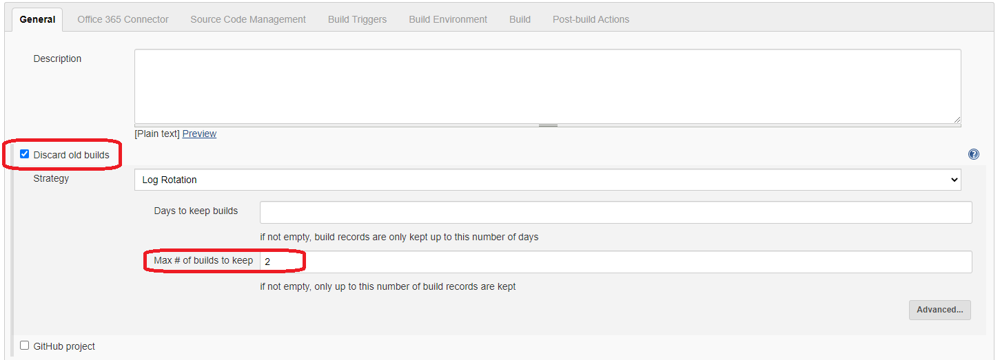
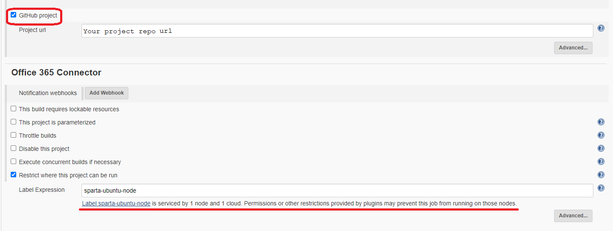
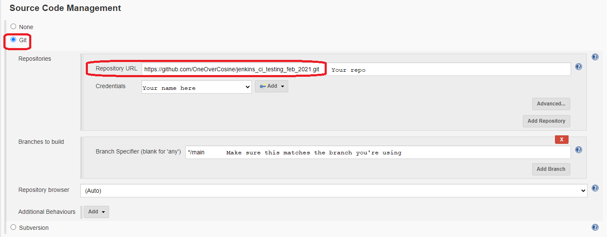
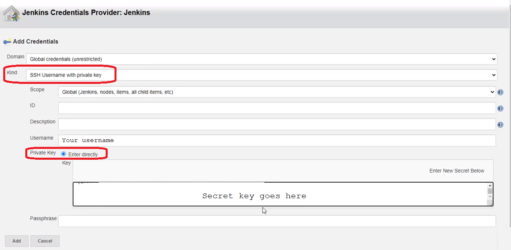
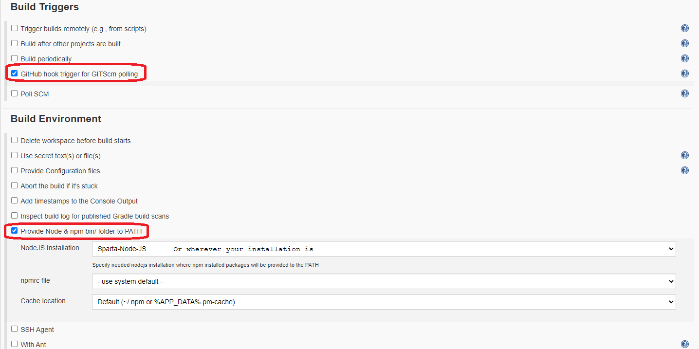
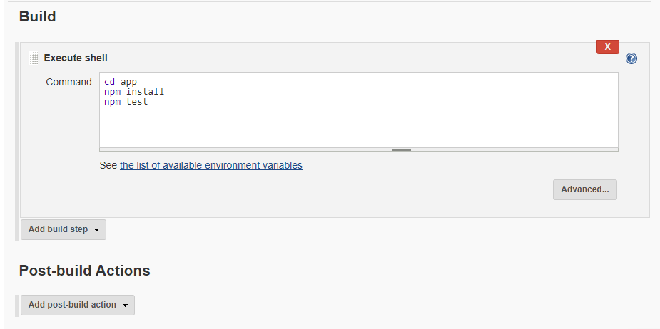

# Test to see if things are working alright?

# Basic CI/CD with Jenkins (Guide)

For the task, see [here](cicd_task.md)

## Prequisites
- GitHub account
- Jenkins account

# Setup for CI

## GitHub Repo
For the sake of time, instead of creating an app, just clone [this repo](https://github.com/khanmaster/jenkins_ci_testing_feb_2021)
1. Create an empty repo for this project
2. On your local machine (in the Terminal, Git Bash, etc.), clone the above repo using `git clone [repo]`. Do this in your empty repo directory
3. Push the changes

## Deploy Key
Now we to need generate keys to use with Jenkins. The following commands are for Windows (using Git Bash).
1. `cd ~/.ssh` - navigate into the correct folder
2. `ssh-keygen -t rsa -b 4096 -C "your_github_email_address"` - to generate the keys
    - Leave all the options not related to the key name blank
3. Open the file containing the ***public*** key: `file_name.pub`
4. In the repo, go to "Settings" --> "Deploy keys" --> "Add deploy key"
5. Copy the contents of the public key file and paste *all of it* into the section labled "Key".
6. Give the key a useful title and check the "Allow write access" box.
7. Hit "Add key"

## Jenkins
1. Log into Jenkins
2. Go to "New item"
3. Enter a name for the job
4. Select "Freestyle project" and hit "OK"

### General and Office 365 Connector
You'll be taken to the following page:  
  
Fill in the details as shown above.  
  
You may need to reselect the option in the last drop-box a few times. You want to see the message that I've underlined in red  
### Source Code Management
  
Select the "Git" radio option. Make sure you fill in the boxes *your* details

You'll need to setup your credentials if you haven't already.  
Hit the "Add" button then select "Jenkins"  
  
The follow pop-up should appear:  
  
Navigate to where your ***private*** key is stored and copy that into the appropriate section.  
Once the details are filled in, it should look something like the above image. Hit "Add" when you're done.  

### Build Triggers and Environment
  

### Build and Post-build Actions
After selecting "Add build step" -> "Execute shell" (image has been truncated to save space):  
  
Copy the following into the "Command" box
```
cd app
npm install
npm test
```
Now hit "Apply" then "Save"  

To make sure everything's working, let's run a build.

## Webhooks
1. In Jenkins, navigate to the main page and copy the URL
2. In your GitHub repo, go to "Settings" --> "Webhooks" --> "Add webhook"
3. In the section titled "Payload URL", paste the URL you copied
4. After the final `/`, add the following: `github-webhook/`
    - The format for the webhook is as follows `http://[ip_address]:[port]/github-webhook/`
5. Click "Add webhook"

## Now, to test that everything is working as intended
1. In your local repo, make a change (in the readme) and push it
2. Go back to Jenkins and check for the most recent build. It should be a few seconds old  

You can check the console output if you want, but it should be the same as earlier. Adding the webhook just means that the build is triggered when you push to the repo.

# Setup for CD
With the integration set up, we want to deploy the code to an EC2 instance.  
A test to see if updates to CI job have taken effect
