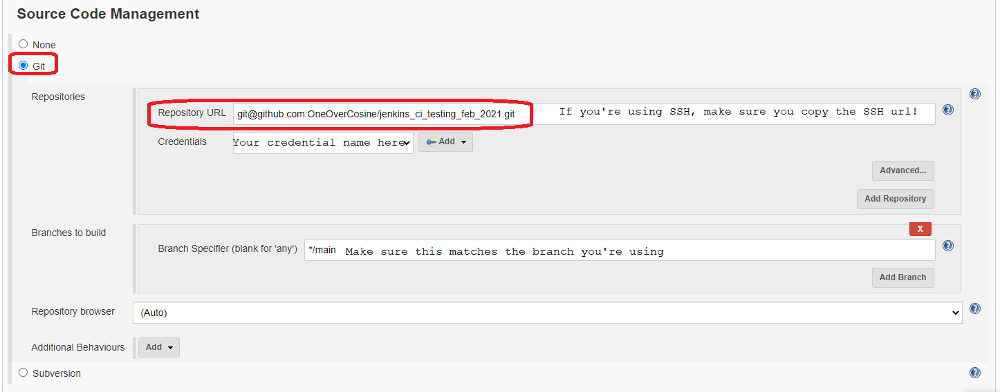

# CI/CD with Jenkins (Guide)

## Prequisites
- GitHub account
- Jenkins account

## GitHub Repo
For the sake of time, instead of creating an app, just clone [this repo](https://github.com/khanmaster/jenkins_ci_testing_feb_2021)
1. Create an empty repo for this project
2. On your local machine (in the Terminal, Git Bash, etc.), clone the above repo using `git clone [repo]`. Do this in your empty repo directory
3. Push the changes

## Deploy Key
Now we need generate keys to use with Jenkins. The following commands are for Windows (using Git Bash).
1. `cd ~/.ssh` - navigate into the correct folder
2. `ssh-keygen -t rsa -b 4096 -C "your_github_email_address"` - to generate the keys
    - Leave all the options not related to the key name blank
3. Open the file containing the ***public*** key: `file_name.pub`
4. In the repo, go to "Settings" --> "Deploy keys" --> "Add deploy key"
5. Copy the contents of the public key file and paste *all of it* into the section labled "Key".
6. Give the key a useful title and leave the "Allow write access" box unchecked.
7. Hit "Add key"

## Jenkins
1. Log into Jenkins
2. Go to "New item"
3. Enter a name for the job
4. Select "Freestyle project" and hit "OK"

### General
You'll be taken to the following page:  

Fill in the details as shown above.  

### Source Code Management
First you need to setup your credentials if you haven't already.  
Hit the "Add" button then select "Jenkins"
  
The follow pop-up should appear:  
  
Navigate to where your ***private*** key is stored and copy that into the appropriate section.  
Once the details are filled in, it should look something like the above image. Hit "Add" when you're done.  

  
Select the "Git" radio option. Make sure you fill in the boxes *your* details

### Build Triggers and Environment


### Build and Post-build Actions
After selecting "Add build step" -> "Execute shell" (image has been truncated to save space):  

Copy the following into the "Command" box
```
cd app
npm install
npm test
```
Now hit "Apply" then "Save"  

To make sure everything's working, let's run a build.

## Webhooks
